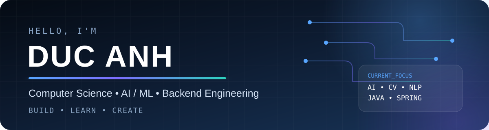
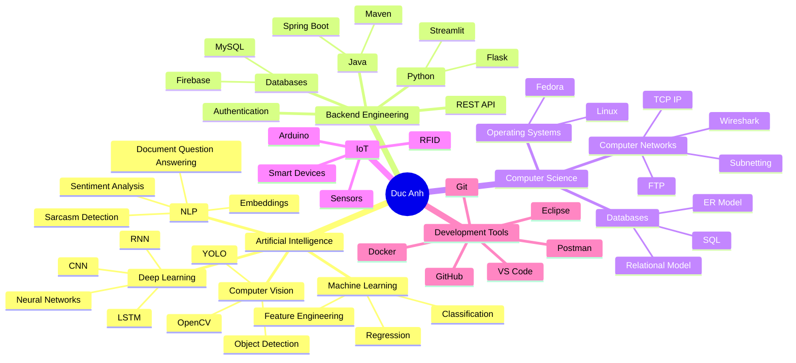

<div align="center">



<br>


</div>

<br>

<table>
<tr>
<td width="55%" valign="top">

<h2 align="center">✨ Profile ✨</h2>

<p>
Hi, I'm <b>Duc Anh</b>, a Computer Science student interested in building intelligent and practical software systems.
</p>

<p>
My main interests are <b>Artificial Intelligence, Machine Learning, Computer Vision, Natural Language Processing, Backend Engineering, and IoT</b>.
</p>

<p>
I enjoy combining AI with real applications: object detection, NLP systems, smart devices, web applications, databases, APIs, and automation.
</p>

<p>
<b>🎯 Current Goal:</b> AI Engineer<br>
<b>🐧 Main OS:</b> Fedora Linux<br>
<b>💻 Main Languages:</b> Python & Java<br>
<b>🧠 Main Focus:</b> AI / ML / CV / NLP<br>
<b>⚙️ Backend:</b> Spring Boot / Flask / REST API
</p>

</td>

<td width="45%" align="center" valign="middle">


<br>


</td>
</tr>
</table>

<br>

<table>
<tr>

<td width="58%" valign="top">

```json
{
  "name": "Duc Anh",
  "username": "Ducanhngo",
  "role": "Computer Science Student",

  "career_goal": "AI Engineer",

  "interests": [
    "Artificial Intelligence",
    "Machine Learning",
    "Deep Learning",
    "Computer Vision",
    "Natural Language Processing",
    "Backend Engineering",
    "Internet of Things"
  ],

  "languages": [
    "Python",
    "Java"
  ],

  "backend": [
    "Spring Boot",
    "Flask",
    "REST API"
  ],

  "databases": [
    "MySQL",
    "Firebase"
  ],

  "environment": {
    "os": "Fedora Linux",
    "editor": [
      "VS Code",
      "Eclipse"
    ]
  }
}
```

</td>

<td width="42%" align="center" valign="middle">


</td>

</tr>
</table>

---

# I. 👨‍💻 About Me

I am currently developing my knowledge in both **Artificial Intelligence** and **Software Engineering**.

Rather than focusing only on theoretical machine learning, I like to build complete systems involving:

- AI models
- Backend servers
- REST APIs
- Databases
- Web applications
- IoT devices
- Linux environments

My long-term direction is to become an **AI Engineer capable of building production AI systems**, not only training models.

---

# II. 🚀 Projects Presentation

| ID | PROJECT | DESCRIPTION | REPOSITORY |
|---:|---|---|---|
| `01` | 🤖 **AI-Powered Checkout System** | Intelligent retail checkout platform combining YOLOv11, Flask, Firebase, Android, Arduino and RFID. | [View Project](https://github.com/Ducanhngo/AI-Powered-Checkout-System) |
| `02` | 🚗 **Car Detection** | Computer-vision project for detecting and localizing vehicles in images and video streams. | [View Project](https://github.com/Ducanhngo/Car_Detection) |
| `03` | 🦺 **YOLOv10 Work Safety** | YOLO-based computer-vision project for workplace safety detection and visual inference. | [View Project](https://github.com/Ducanhngo/Project_YOLOv10_Worksafety) |
| `04` | 📄 **Document Q&A** | Streamlit application for asking questions about uploaded documents using language models. | [View Project](https://github.com/Ducanhngo/document-qa) |
| `05` | 🧠 **Sarcasm Detection** | NLP project comparing classical ML and BERT for sentiment analysis and sarcasm detection. | [View Project](https://github.com/Ducanhngo/Sarcasm-Detection) |
| `06` | 🖼️ **Text Image Project** | Experiments involving text processing and image-related AI workflows. | [View Project](https://github.com/Ducanhngo/Text_Image_Project) |
| `07` | 🔬 **CNN Project** | Deep-learning experiments centered around convolutional neural networks and computer vision. | [View Project](https://github.com/Ducanhngo/CNN-Project) |
| `08` | 🚙 **IoT Car Project** | IoT and embedded-system project combining vehicle control, hardware and software. | [View Project](https://github.com/Ducanhngo/Iot_Car_Project) |
| `09` | 💡 **IoT Light Control** | Connected lighting project exploring IoT communication and remote device control. | [View Project](https://github.com/Ducanhngo/Iot-Light-Control) |
| `10` | ❤️ **Heart Prediction** | Machine-learning project exploring prediction from health-related structured data. | [View Project](https://github.com/Ducanhngo/Heart_Prediction) |

---

# III. 🛠️ Technologies & Tools

<h3 align="center">Artificial Intelligence</h3>

<p align="center">

</p>

<h3 align="center">Backend & Databases</h3>

<p align="center">

</p>

<h3 align="center">Development</h3>

<p align="center">

</p>

<h3 align="center">IoT & Hardware</h3>

<p align="center">

</p>

<br>

<table align="center">

<tr>

<td align="center" width="120">
<br>
<b>Python</b>
</td>

<td align="center" width="120">
<br>
<b>Java</b>
</td>

<td align="center" width="120">
<br>
<b>PyTorch</b>
</td>

<td align="center" width="120">
<br>
<b>TensorFlow</b>
</td>

<td align="center" width="120">
<br>
<b>OpenCV</b>
</td>

</tr>

<tr>

<td align="center">
<br>
<b>Spring Boot</b>
</td>

<td align="center">
<br>
<b>Flask</b>
</td>

<td align="center">
<br>
<b>MySQL</b>
</td>

<td align="center">
<br>
<b>Firebase</b>
</td>

<td align="center">
<br>
<b>Postman</b>
</td>

</tr>

<tr>

<td align="center">
<br>
<b>Linux</b>
</td>

<td align="center">
<br>
<b>Git</b>
</td>

<td align="center">
<br>
<b>GitHub</b>
</td>

<td align="center">
<br>
<b>Docker</b>
</td>

<td align="center">
<br>
<b>Arduino</b>
</td>

</tr>

</table>

---

# IV. 🧠 Knowledge Map



---

# V. 📊 GitHub Activity

<div align="center">


<br><br>


</div>

<br>

<table align="center">
<tr>

<td>

</td>

<td>

</td>

</tr>

<tr>

<td>

</td>

<td>

</td>

</tr>
</table>

---

# VI. 🧪 What I'm Currently Learning

```text
Artificial Intelligence
├── Machine Learning
├── Deep Learning
├── Computer Vision
│   ├── YOLO
│   └── OpenCV
├── NLP
│   ├── RNN
│   ├── LSTM
│   ├── Transformers
│   └── LLM Applications
│
Software Engineering
├── Java
│   └── Spring Boot
├── REST API
├── MySQL
├── Git / GitHub
└── Docker

Computer Science Foundations
├── Database Systems
├── Computer Networks
├── Operating Systems
└── Linux
```

---

# VII. 🌐 Profile

<div align="center">

<a href="https://github.com/Ducanhngo">

</a>

<a href="https://github.com/Ducanhngo?tab=repositories">

</a>

</div>

---

# VIII. 👀 Visitor Statistics

<div align="center">


</div>

<br>

<div align="center">

### `Build • Learn • Create`

<sub>
Computer Science • Artificial Intelligence • Software Engineering
</sub>

<br><br>


</div>
