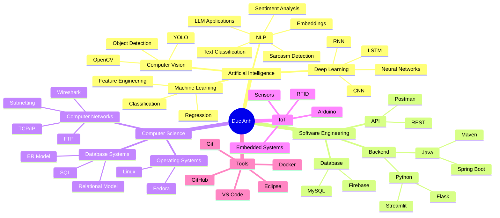

<div align="center">


<br><br>

### `Computer Science × Artificial Intelligence × Software Engineering`

<sub>
Building intelligent systems, learning how they work, and turning ideas into real software.
</sub>

</div>

<br>

<table>
<tr>

<td width="68%" valign="top">

<h2>⚡ SYSTEM.PROFILE</h2>

<p>
Hi, I'm <b>Duc Anh</b> — a Computer Science student interested in building
systems that combine <b>Artificial Intelligence</b> with practical software engineering.
</p>

<p>
My main areas of interest are:
</p>

<p>
🧠 <b>Artificial Intelligence & Machine Learning</b><br>
👁️ <b>Computer Vision</b><br>
📝 <b>Natural Language Processing</b><br>
☕ <b>Java & Spring Boot Backend</b><br>
🌐 <b>Computer Networks & APIs</b><br>
🤖 <b>IoT & Intelligent Devices</b>
</p>

<br>

<pre>
CURRENT_STATUS
────────────────────────────────────
Role        : Computer Science Student
Goal        : AI Engineer
Main OS     : Fedora Linux
AI          : Python • PyTorch • YOLO
Backend     : Java • Spring Boot
Database    : MySQL • Firebase
Current     : Building + Learning
────────────────────────────────────
</pre>

</td>

<td width="32%" align="center" valign="middle">


<br><br>

<h3>Duc Anh</h3>

<code>@Ducanhngo</code>

<br><br>

<b>AI • Backend • Linux</b>

<br><br>

<a href="https://github.com/Ducanhngo?tab=repositories">

</a>

</td>

</tr>
</table>

---

## `01 / WHOAMI`

```json
{
  "identity": {
    "name": "Duc Anh",
    "username": "Ducanhngo",
    "role": "Computer Science Student"
  },

  "mission": "Become an AI Engineer",

  "interests": {
    "artificial_intelligence": [
      "Machine Learning",
      "Deep Learning",
      "Computer Vision",
      "Natural Language Processing"
    ],

    "software_engineering": [
      "Backend Development",
      "REST APIs",
      "Databases",
      "System Design"
    ],

    "systems": [
      "Linux",
      "Computer Networks",
      "IoT"
    ]
  },

  "philosophy": [
    "Understand the fundamentals",
    "Build real systems",
    "Learn by experimentation"
  ]
}
```

---

# `02 / FEATURED SYSTEMS`

<table>
<tr>
<td width="50%" valign="top">

### 🤖 AI-Powered Checkout System
**AI + CV + IoT + Web**

A smart retail checkout ecosystem combining object detection, RFID, Flask, Firebase, Android, and embedded devices.

**Stack:**  
`Python` `YOLO` `Flask` `Firebase` `Arduino`

[→ Explore repository](https://github.com/Ducanhngo/AI-Powered-Checkout-System)

---

### 👁️ Car Detection
**Object Detection**

A computer-vision project focused on detecting and localizing vehicles in images and video.

**Stack:**  
`Python` `YOLO` `OpenCV`

[→ Explore repository](https://github.com/Ducanhngo/Car_Detection)

---

### 🦺 YOLOv10 Workplace Safety
**Computer Vision**

A workplace-safety detection project using YOLOv10 for visual inference and detection experiments.

**Stack:**  
`Python` `YOLOv10` `Deep Learning`

[→ Explore repository](https://github.com/Ducanhngo/Project_YOLOv10_Worksafety)

</td>

<td width="50%" valign="top">

### 🧠 Sarcasm Detection
**Natural Language Processing**

An NLP project comparing classical ML models and deep-learning approaches for sentiment and sarcasm detection.

**Stack:**  
`Python` `NLP` `BERT` `Machine Learning`

[→ Explore repository](https://github.com/Ducanhngo/Sarcasm-Detection)

---

### 📄 Document Q&A
**LLM Application**

A document question-answering app where users can upload files and ask questions about the content.

**Stack:**  
`Python` `Streamlit` `LLM`

[→ Explore repository](https://github.com/Ducanhngo/document-qa)

---

### 🚙 More Projects
- [CNN Project](https://github.com/Ducanhngo/CNN-Project)
- [Text Image Project](https://github.com/Ducanhngo/Text_Image_Project)
- [IoT Car Project](https://github.com/Ducanhngo/Iot_Car_Project)
- [Heart Prediction](https://github.com/Ducanhngo/Heart_Prediction)

</td>
</tr>
</table>

# `03 / TECH ARSENAL`

### Artificial Intelligence

<p align="center">


</p>

### Backend Engineering

<p align="center">


</p>

### Development Environment

<p align="center">


</p>

### Hardware & IoT

<p align="center">


</p>

---

# `04 / KNOWLEDGE MAP`



---

# `05 / CURRENT LEARNING`

```text
AI ENGINEERING
│
├── Machine Learning
│   ├── Models
│   ├── Evaluation
│   └── Feature Engineering
│
├── Deep Learning
│   ├── CNN
│   ├── RNN
│   ├── LSTM
│   └── Transformers
│
├── Computer Vision
│   ├── YOLO
│   └── OpenCV
│
├── NLP
│   ├── Embeddings
│   ├── BERT
│   └── LLM Applications
│
└── Production Engineering
    ├── Java
    ├── Spring Boot
    ├── REST APIs
    ├── MySQL
    ├── Docker
    └── Linux
```

---

# `06 / GITHUB`

<div align="center">


<br><br>


</div>

---

# `07 / CONNECT`

<div align="center">

<a href="https://github.com/Ducanhngo">
  
</a>

<a href="https://github.com/Ducanhngo?tab=repositories">
  
</a>

</div>

<br>

<div align="center">


</div>

<br>

<div align="center">

```text
╭──────────────────────────────────────────────╮
│                                              │
│         BUILD • UNDERSTAND • IMPROVE         │
│                                              │
│       Computer Science × Intelligence        │
│                                              │
╰──────────────────────────────────────────────╯
```

</div>
